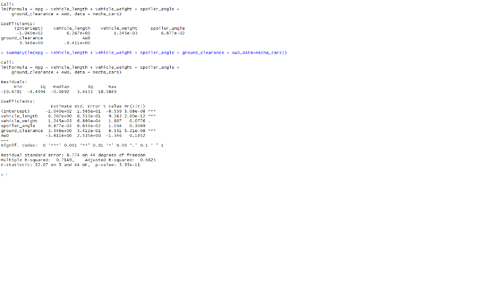

# MechaCar_Statistical_Analysis
## Linear Regression to Predict MPG

As seen in the picture above only AWD, spoiler_angle and vehicle weight show a non-random variance to the mpg of the vehichle. The slope is not considered to be zero as there is an active relation between the change in mpg and the  independent variables. The R squared value of 0.7149 falls just into the category of high statistical significance making this model useful as a predictor. 

## Summary Statistics on Suspension Coil

Lot 1 and 2 are both within specifications but lot 3 exceeds design tolerance. 

## T-Tests on Suspension Coils
[label](Untitled4.png%0D) 

lot 3 is the only lot showing statistical significance in the P value and variation from the mean. This shows that the coils from lot 2 are not being made to manufacturing standards. 

## Study Design: MechaCar vs Competition
To see how the MechaCar performs against other manufacturers cars I believe 3 areas should be focused on cost, safety, and fuel effeciency. Generally I believe that lower a higher mpg rating and saftey rating will correlate to a higher cost. The null hypothesis being that this is untrue and there is no correlation while that alternative hpyothesis is that we will see cost rise with better safety and higher mpg ratings. To this end I will use multiple linear regression as it will allow a focused and concise approach to the problem. To run this I will need the mpg info, cost info, and safety info on comparable cars from competing manufacturers. 